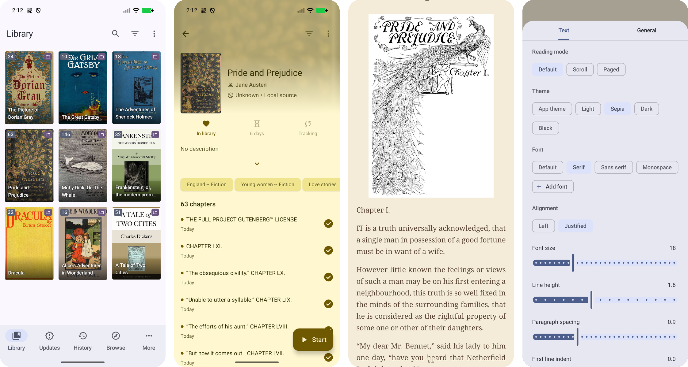

 
 <h1 align="center"> Yomikku </h1>

*Requires Android 8.0 or higher.*

## Download

*Requires Android 8.0 or higher.*

Light-novel reader for Android. A fork of [Komikku](https://github.com/mKonic/komikku) with the manga reader replaced by a text reader.

## Issues, Feature Requests and Contributing

Pull requests are welcome. For major changes, please open an issue first to discuss what you would like to change.

Issues

1. **Before reporting a new issue, take a look at the [changelog](https://github.com/mKonic/yomikku/releases) and the already opened [issues](https://github.com/mKonic/yomikku/issues).**

Bugs

* Include version (More → About → Version)
 * If not latest, try updating, it may have already been solved
 * Preview version is equal to the number of commits as seen on the main page
* Include steps to reproduce (if not obvious from description)
* Include screenshot (if needed)
* If it could be device-dependent, try reproducing on another device (if possible)
* Don't group unrelated requests into one issue

Use the [issue forms](https://github.com/mKonic/yomikku/issues/new/choose) to submit a bug.

Feature Requests

* Write a detailed issue, explaining what it should do or how.
* Include screenshot (if needed).

Contributing

See [CONTRIBUTING.md](./CONTRIBUTING.md).

Code of Conduct

See [CODE_OF_CONDUCT.md](./CODE_OF_CONDUCT.md).

### Credits

Thank you to all the people who have contributed!

### Disclaimer

The developer(s) of this application does not have any affiliation with the content providers available, and this application hosts zero content.

## License

    Copyright 2015 Javier Tomás

    Licensed under the Apache License, Version 2.0 (the "License");
    you may not use this file except in compliance with the License.
    You may obtain a copy of the License at

    http://www.apache.org/licenses/LICENSE-2.0

    Unless required by applicable law or agreed to in writing, software
    distributed under the License is distributed on an "AS IS" BASIS,
    WITHOUT WARRANTIES OR CONDITIONS OF ANY KIND, either express or implied.
    See the License for the specific language governing permissions and
    limitations under the License.
